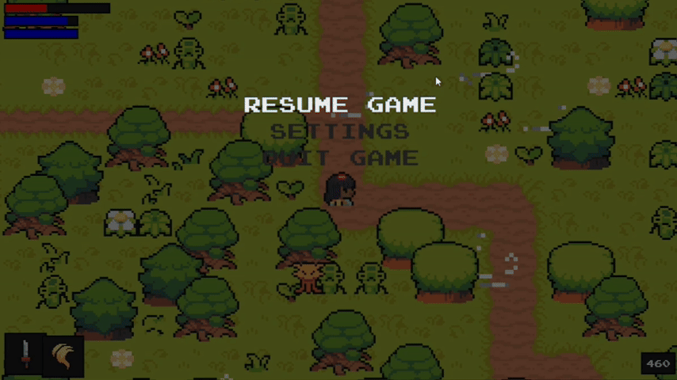

<h1 align="center">
   🎮 <strong>RPG Eldoria</strong> 🎮
</h1>


## Introduction 🌍
**RPG Eldoria** is a 2D RPG developed in **Python** using the Pygame library.. Inspired by games like **Stardew Valley** and **Dark Souls**, the game combines a **pixel art** visual style with challenging combat and exploration mechanics. Designed to ensure a smooth and accessible experience, the game implements various optimizations and unique features focused on performance chunks and gameplay depth.

<br>

## Directory Structure 📂

The project directory is organized to separate the different parts of the game, such as audio, graphics, and code. Below is an overview of the directory structure:


<br>

---

## Key Features ⚙️

### 1. Optimized Chunk System 🌲
- **Map based on chunks**:
  - The world is divided into small areas called **chunks**.
  - Only chunks near the player are loaded, optimizing performance and reducing memory usage.
  - Explored chunks are temporarily stored in a folder called `chunk`!
    - After the player exits the game, the folder is automatically cleared.
    - In the future, the **save progress** feature will be added to preserve explored areas.
  - **Dynamic loading**: Chunks are loaded automatically as the player approaches new areas. <br>
  
---

### 2. NPC and Quest System 🧑‍🤝‍🧑


- **NPC Interactions**:
  - NPCs are key elements of the game, offering dynamic dialogues with a typing effect for immersion.
  - NPC responses vary depending on the player's progress and accumulated points. <br>

- **Quest System**:
  - NPCs assign **missions** (quests) to the player.
  - Each completed mission grants an **exclusive reward**, such as:
    - New weapons ⚔️.
    - Rare items 🎁. <br>

---

<br>

### 3. Full Menu System 🖥️


<br>

The main menu offers several customizable options: <br>
- **Performance modes**: 
  - **Optimized**: Balances graphics quality and performance.
  - **Normal**: Standard game configuration.
  - **Extreme Performance**: For low-performance devices, reducing visual effects for smoother gameplay.<br>
    
- **Screen settings**:
  - Full screen.
  - Borderless window.
  - Manual resolution adjustment.<br>
    
- **Sound effects**: 
  - Unique sounds for buttons and interactions in the menu, enhancing the player's experience.<br>
    
- **Cinematic Intro**: 
  - Before the game starts, an animated intro tells the backstory of Eldoria, introducing the player to the universe and its challenges.<br>

---

### 4. Particle System ✨
- **Visual Effects**:
  - Animated particles for attacks, explosions, spells, and weather effects (such as rain and dust).
  - Optimized effects for different performance modes.

---

### 5. Map Creation and Management 🗺️
- **Tiled Engine**:
  - The game map is designed using the **Tiled Map Editor**, allowing for:
    - Easy tile editing.
    - Addition of custom layers (such as objects, terrain, and collisions).<br>
  - The chunk system ensures that areas are dynamically loaded:
    - Chunks near the player are rendered.
    - Previously visited areas do not need to be reloaded.

---

### 6. Combat and Gameplay ⚔️


<br>


- **Dark Souls-inspired style**:
  - Challenging battles against enemies and bosses (boss fights).
  - Requires strategy and quick reflexes.<br>
- **Inventory System**:
  - Manage items collected throughout the game, such as weapons, potions, and other resources.
  - The inventory allows for equipping weapons and checking quest items. <br>

---

## Technologies Used 🛠️
- **Python 3.x** 🐍
- **Pygame**: For graphical rendering and gameplay control 🎮.
- **Tiled Map Editor**: For map creation and editing 🗺️.
- **SQLite** (future): For implementing the save system 💾. <br>

---

<br>

## File Overview 📂

- **Tiles Regeneration**: 
  - In **Optimized Mode** 🏞️, the tile size (`TILESIZE`) is smaller, and fewer chunks are loaded, which results in fewer resources being used by the game, helping it run smoothly on lower-performance systems. This reduces the visual detail of the environment, but the player still experiences a playable and optimized version of the game.
  - In **Normal Mode** 🎮, the tile size and the number of visible chunks are set to medium values. This strikes a balance between performance and visual quality, allowing the game to run well while providing a good level of detail.
  - In **Extreme Mode** ⚡, larger tiles and more visible chunks are rendered, making the game look more detailed but demanding more resources from the system.

- **Wind Effects** 🌬️:
  - The wind effects, such as their interval (`wind_effect_interval`) and duration (`wind_effect_duration`), are also modified depending on the performance mode.
    - In **Optimized Mode** 🛠️, the wind effects appear less frequently and last for a shorter duration to reduce the strain on the system.
    - In **Normal Mode** 🌿, the wind effects occur more regularly and last a bit longer, balancing performance and realism.
    - In **Extreme Mode** 🌪️, wind effects are more frequent and longer, adding to the immersive experience with enhanced visual effects.

<br><br>

## Credits 💡
Developed by
```bash
  - GabrielNat1
```

<br>

Pack Tile used:
```
  - NinjaAdventurePack
```

---
