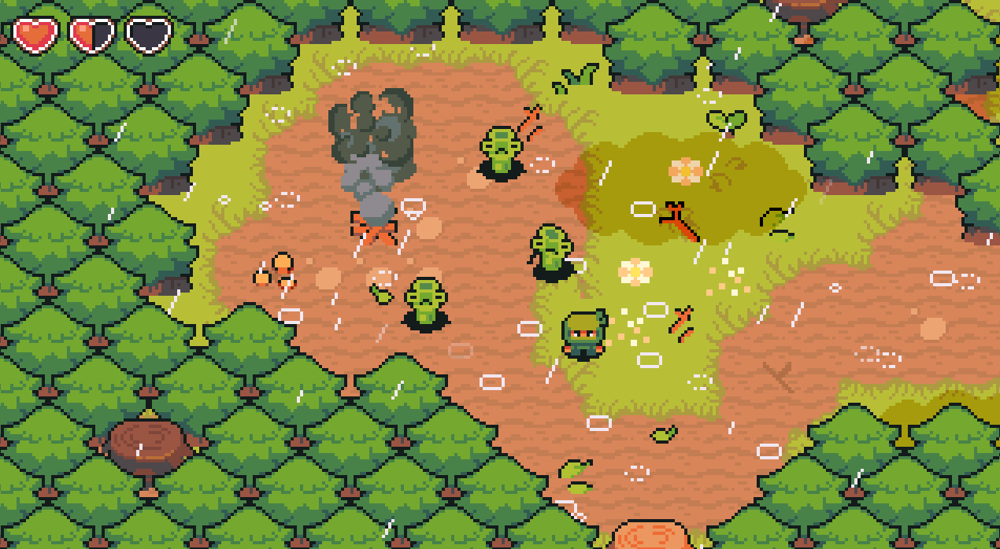

<h1 align="center">
   🎮 <strong>RPG Eldoria</strong> 🎮
</h1>

## Introduction 🌍
**RPG Eldoria** is a 2D RPG developed in **Python** using the Pygame library. Inspired by games like **Stardew Valley** and **Dark Souls**, the game combines a **pixel art** visual style with challenging combat and exploration mechanics.

## 📚 Main Sections
- [Features & Systems](./features.md)
- [Technical Details](./technical.md)
- [Combat & Gameplay](./gameplay.md)
- [Polling System (Coming Soon)](./polling.md)
- [Credits & Attribution](./credits.md)
- [License](../LICENSE)
- [Security](../SECURITY.md)

---

## 🔗 Quick Links
- [Installation Guide](./technical.md#installation)
- [Game Controls](./gameplay.md#controls)
- [Requirements & Benchmark](./eldoria-benchmark.md)
- [Report a Bug / Security Vulnerabilities](../SECURITY.md#reporting-a-vulnerability)
- [Project Wiki](https://github.com/GabrielNat1/RPG-Eldoria/wiki)

