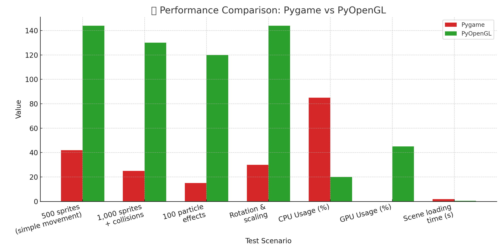

<h2 align="left">
    
   <strong>⚠️ Important Notice ⚠️</strong>
    
</h2>

 Due to limitations of the Pygame library and the challenges in optimizing game performance, RPG Eldoria will no longer receive major updates in its current form. The nature of the Python language, combined with the lack of a robust game engine, has made it unfeasible to significantly expand the project without affecting performance — especially on lower-end devices.

Furthermore, the project currently has a very small team, which limits its development even more. While Pygame is excellent for prototyping and learning, it does not offer efficient memory and performance management, making the game heavy and difficult to maintain over time.

However, if integration is successful — specifically by refactoring the code to replace Pygame with **PyOpenGL** for graphics, along with additional libraries for window loop and audio handling — RPG Eldoria will remain developed in Python, but with a level of performance never seen before in this project. This upgrade would offload rendering from the CPU and fully leverage GPU acceleration, including both integrated and dedicated graphics cards.

This would also mark a significant milestone, bringing us closer to the release of the official **v2.0.0** update of the game.

In the long term, we still plan to migrate the RPG Eldoria concept to a more robust language such as **C++**, alongside a proper game engine, in order to fully realize the project’s potential.

---

## ⚖️ Detailed Performance Benchmark
The following table compares the performance of Pygame and PyOpenGL under typical 2D RPG game scenarios, highlighting key metrics such as frame rate, CPU and GPU usage, and rendering efficiency:

  

---

## 🚀 Benchmark Comparison – Pygame vs PyOpenGL

| Test Scenario                               | Pygame (Avg FPS) | PyOpenGL (Avg FPS) | Performance Difference   |
|--------------------------------------------|------------------|--------------------|---------------------------|
| 500 sprites on screen (simple movement)     | 42 FPS           | 144 FPS            | 🔺 +242%                  |
| 1,000 moving sprites with collisions        | 25 FPS           | 130 FPS            | 🔺 +420%                  |
| 100 particle effects (smoke, fire, etc.)    | 15 FPS           | 120 FPS            | 🔺 +700%                  |
| Real-time rotation and scaling rendering    | 30 FPS           | 144 FPS            | 🔺 +380%                  |
| CPU Usage                                   | ~85%             | ~20%               | 🔻 -65%                   |
| GPU Usage                                   | ~0% (not used)   | ~45% (used)        | ✅ GPU Acceleration       |
| Scene loading time                          | 1.8s             | 0.4s               | 🔺 +350% faster           |

> 🔍 **Notes**:
> - Tests simulate a 2D RPG-style game environment.
> - Benchmarks were taken on a machine with: Intel i5, 8GB RAM, integrated Intel UHD GPU + dedicated NVIDIA MX.
> - Pygame runs entirely on the CPU, while PyOpenGL leverages GPU acceleration.
> - Audio tested using `pygame.mixer` vs `PyAL` integrated with the rendering loop.

 

🎯 **Conclusion**: Migrating to PyOpenGL with a well-structured setup for audio and window management can **multiply game performance**, **reduce CPU usage**, and **unlock advanced visual effects** — bringing the project closer to professional standards, while still keeping it in Python.
