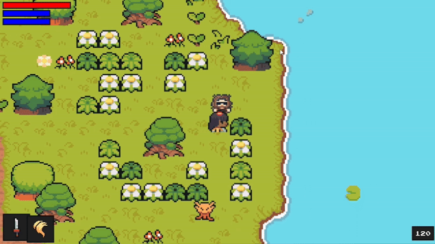

# Features & Systems 🎮

## 1. Optimized Chunk System 🌲
- **Map based on chunks**:
  - The world is divided into small areas called **chunks**
  - Only chunks near the player are loaded
  - Explored chunks are temporarily stored in a `chunk` folder
  - Dynamic loading of new areas
  - Memory efficient design

## 2. NPC and Quest System 🧑‍🤝‍🧑

- **NPC Interactions**
  - Dynamic dialogue system
  - Character progression impacts conversations
  - Immersive typing effect
  - Branching dialogue paths

- **Quest System**
  - Multiple quest types
  - Dynamic reward system
  - Progress tracking
  - Quest-dependent world changes

## 3. Performance Optimization 🚀
- **Graphics Modes**:
  - Optimized Mode
  - Normal Mode
  - Extreme Performance Mode
- **Screen Options**:
  - Multiple resolution support
  - Fullscreen/Windowed modes
  - Custom aspect ratios

## 4. Audio System 🎵
- Dynamic background music
- Context-sensitive sound effects
- Volume control for:
  - Master volume
  - Music volume
  - Effects volume
- Custom audio triggers

## 5. Debug & Development Tools 🛠️
- FPS counter
- Debug console
- Performance metrics
- Memory usage tracking
